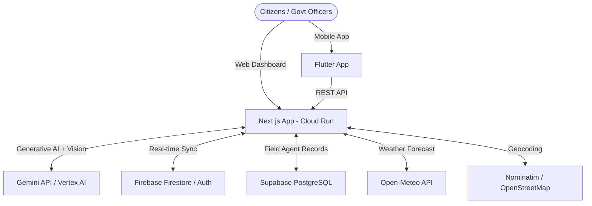

# 🌿 Nexus-Green

> **AI-powered smart city command dashboard for real-time urban heat, air quality, and traffic management across Indian cities.**

[](https://nextjs.org/)
[](https://www.typescriptlang.org/)
[](https://cloud.google.com/run)
[](https://ai.google.dev/)
[](LICENSE)

---

## 🔗 Live Demo

👉 [Live Demo](https://your-cloud-run-url) &nbsp;|&nbsp; [GitHub](https://github.com/AmanHatmode/nexus-green)

---

## 🚀 Features

- **🗺️ Real-Time Interactive Map** — Leaflet-based map of 50+ Indian city wards, color-coded by live risk level (green / amber / red)
- **🤖 Gemini AI Advisory** — One-click generation of classified field advisories with a typewriter animation and AI confidence score ring
- **🌡️ Thermal Camera Mode** — Simulated thermal overlay on Google Street View for selected zones
- **📡 Live Alert Ticker** — Auto-rotating incident ticker with critical / warning / info severity levels
- **📊 Heat Analysis Tab** — Interactive scatter plot of temperature vs AQI correlation across all wards, with a top-10 hotspot leaderboard
- **📅 7-Day Predictive Forecast** — Area chart + risk index bar chart driven by the Open-Meteo weather API
- **🚒 Dispatch Board** — Full operations table for field hydration, medical, and traffic units with live status tracking
- **📸 Cloud Vision Field Reports** — Upload field photographs for neural-network environmental risk assessment (Gemini multimodal)
- **📄 PDF Report Export** — One-click jsPDF export of city metrics and the selected zone advisory
- **👮 Officer Access Gate** — Authentication screen before entering the command dashboard
- **📱 Flutter Mobile App** — Companion app for field officers (in `/nexus_green_app`)

---

## 🛠️ Tech Stack

| Layer | Technology |
|---|---|
| **Frontend** | Next.js 15 (App Router), React 18, TypeScript, Recharts, Leaflet |
| **Styling** | Vanilla CSS with glassmorphism design system |
| **Backend / API** | Next.js Route Handlers (`/api/*`), Vercel AI SDK |
| **AI** | Google Gemini 1.5 Pro (text advisory + multimodal vision) |
| **Database** | Supabase (PostgreSQL) for field agent records |
| **Weather Data** | Open-Meteo API (free, no key required) |
| **Maps** | Leaflet.js + OpenStreetMap + Nominatim geocoding |
| **Mobile** | Flutter (Dart) — cross-platform iOS & Android |
| **DevOps** | Docker, Google Cloud Run, Cloud Build |

---

## 🏗️ Architecture



---

## ⚡ Getting Started

### Prerequisites

- Node.js ≥ 18
- npm ≥ 9
- A [Google AI Studio](https://aistudio.google.com/) API key (Gemini)
- A [Supabase](https://supabase.com/) project (free tier works)

### 1 — Clone the repo

```bash
git clone https://github.com/AmanHatmode/nexus-green.git
cd nexus-green/nexus-green-api
```

### 2 — Configure environment variables

```bash
cp .env.example .env.local
```

Open `.env.local` and fill in your values:

```env
GEMINI_API_KEY=your_gemini_api_key_here
NEXT_PUBLIC_SUPABASE_URL=https://your-project.supabase.co
NEXT_PUBLIC_SUPABASE_ANON_KEY=your_supabase_anon_key_here
```

> All required variables are documented with descriptions in [`.env.example`](.env.example).

### 3 — Install and run

```bash
npm install
npm run dev
```

Open [http://localhost:3000](http://localhost:3000) in your browser.

---

## ☁️ Deployment

Full step-by-step instructions for deploying to **Google Cloud Run** (including Docker build, Cloud Build, and environment variable configuration) are in:

📄 **[DEPLOY_CLOUD_RUN.md](DEPLOY_CLOUD_RUN.md)**

---

## 📁 Project Structure

```
nexus-green-api/          # Next.js web dashboard + API
├── app/
│   ├── page.tsx          # Orchestration layer (state + API calls)
│   └── api/              # Route handlers: /advisory, /metrics, /forecast, /dispatch, /resources, /cloud-vision
├── components/
│   ├── AdvisoryPanel.tsx # AI advisory + confidence ring + dispatch controls
│   ├── MetricsPanel.tsx  # Zone stats grid + Street View iframe
│   ├── AlertTicker.tsx   # Live alert ticker
│   ├── DispatchBoard.tsx # Field operations table
│   ├── ForecastTab.tsx   # 7-day forecast charts
│   ├── FieldReportsTab.tsx # Cloud Vision upload + results
│   └── Map.tsx           # Leaflet interactive map
├── lib/
│   ├── constants.ts      # ZoneData interface + INDIA_CITIES dataset
│   └── types.ts          # Shared interfaces (VisionResult, ForecastEntry, DispatchEntry)
└── nexus_green_app/      # Flutter mobile companion app
```

---

## 🤝 AI Component Details

| API | Usage |
|---|---|
| **Gemini 1.5 Pro** | Generates structured field advisories from zone temperature, AQI, traffic, and historical max data |
| **Gemini Vision (multimodal)** | Analyzes uploaded field images, returns risk labels, heat score, and safety assessment |
| **Vercel AI SDK** | Orchestrates streaming responses and prompt construction within Next.js route handlers |

---

## 📝 License

MIT — see [LICENSE](LICENSE) for details.

---

<p align="center">Built for the Google AI Hackathon · Nagpur, India 🇮🇳</p>
